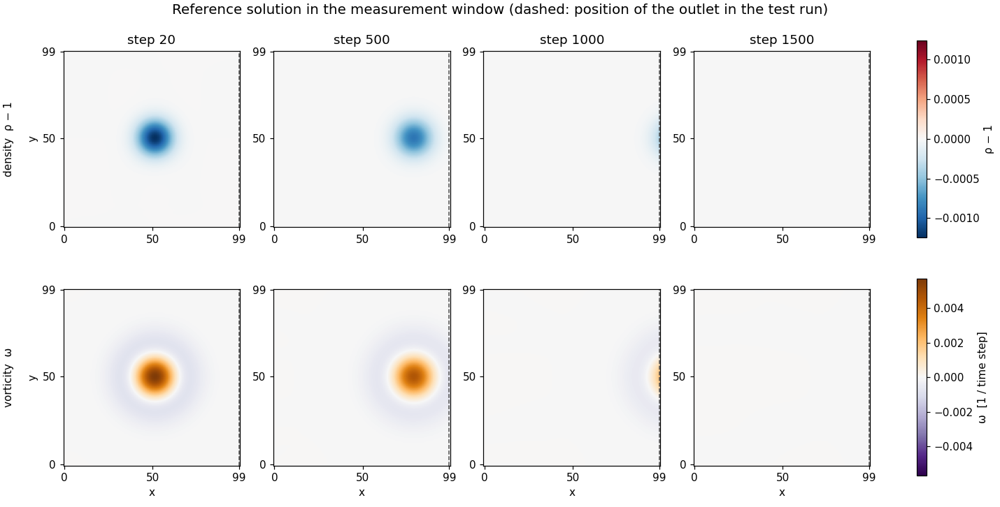
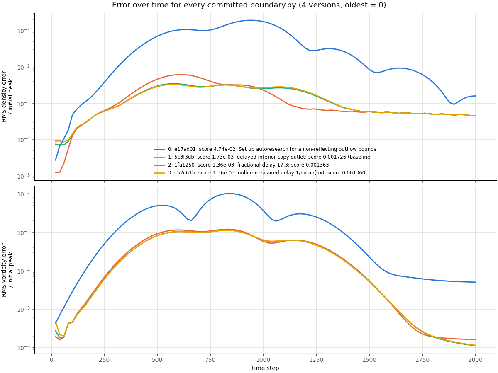
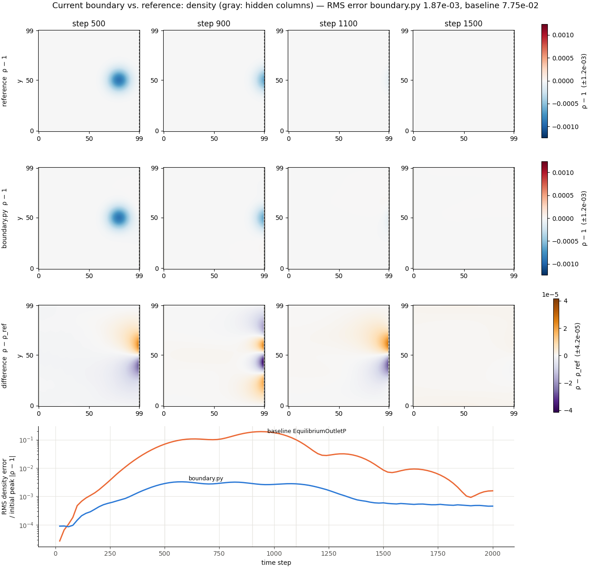
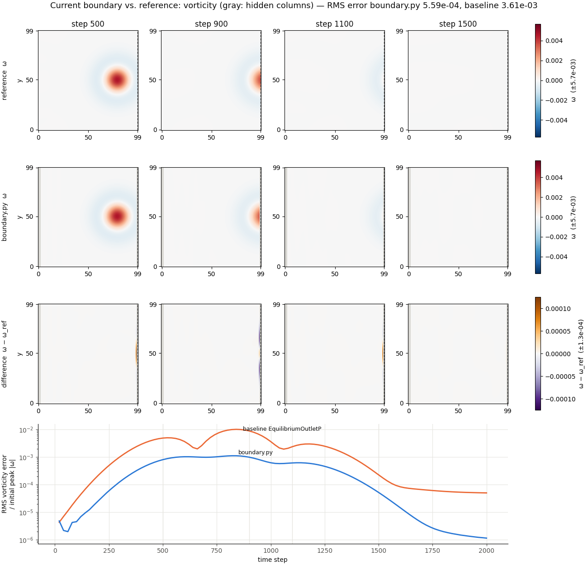

# Vortex outflow: autoresearch on characteristic boundary conditions

An AI agent iteratively improves a **non-reflecting outflow boundary
condition** for lettuce. The setup follows
[karpathy/autoresearch](https://github.com/karpathy/autoresearch): a fixed
evaluation, a single file the agent may edit, and an open-ended loop of
*change → measure → keep or discard*.

## Motivation

Open boundaries in lattice Boltzmann simulations reflect part of the outgoing
flow structures and acoustic waves back into the domain. These reflections
pollute the solution, especially in aeroacoustics and in long simulations of
wakes and jets. Characteristic boundary conditions (CBC) suppress incoming
waves by decomposing the flow at the boundary into characteristic waves. Many
variants exist, and their quality depends on details: how derivatives are
estimated, how the unknown populations are reconstructed, how transverse
terms and relaxation are treated. This project lets an agent explore that
design space systematically against a fixed, quantitative benchmark.

## Test case

A Lamb-Oseen vortex is convected by a uniform flow through the right edge of
the domain (Wissocq et al. 2017).

| Parameter | Value |
|---|---|
| Domain | 100 × 100 lattice nodes, periodic in y |
| Inflow (left) | `EquilibriumBoundaryPU`, uniform velocity, fixed |
| Outflow (right) | **candidate boundary from `boundary.py`** |
| Lattice / collision | D2Q9, BGK, double precision |
| Mach number of the mean flow | 0.1 |
| Reynolds number (mean flow, domain height) | 500 |
| Vortex | isothermal Lamb-Oseen, core radius 10 nodes, strength β = 0.5 |
| Duration | 2000 steps (the vortex has left after ~1400) |

**Reference.** The same initial state is simulated on a periodic domain of
2474 × 100 nodes, which is long enough that no wave can travel around and
re-enter the measurement window during the run. Within the window this is the
solution of an infinite domain. It is computed once and cached in `.cache/`.



The vortex is a density dip of about 1.2·10⁻³ held by radial pressure
equilibrium, with a positive vorticity core and a weak negative ring (zero net
circulation). It moves with the mean flow (≈ 0.058 nodes per step) and weakens
by viscous spreading of the core (about 15 % over the first 500 steps). After
step ~1500 the window of the reference is empty, so anything left in the test
run is reflection from the outlet.

All constants live at the top of `prepare.py`.

## Metric

The candidate run is sampled every 20 steps and compared with the reference
on all interior nodes (the boundary columns are excluded).

- `err_rho`: RMS density error, normalised by the density dip in the vortex core
- `err_u`: RMS velocity error, normalised by the peak swirl velocity
- **`score = (err_rho + err_u) / 2`**: lower is better, 0 is perfect
- `err_rho_late`: density error over the last quarter of the run, after the
  vortex has left. It isolates reflected acoustic waves (diagnostic only).

A run that diverges or exceeds the 300 s time limit scores `inf`.

Sanity checks done when the setup was built: the vortex in the reference moves
at the expected speed, the error only grows once the vortex reaches the outlet,
and the fixed inflow on its own contributes an error of about 2·10⁻⁴, two to
three orders of magnitude below the baseline outlet's error.

| Boundary | score | err_rho_late |
|---|---|---|
| `EquilibriumOutletP` (baseline) | 0.047 | 0.006 |

## Files

| File | Role | Editable by the agent |
|---|---|---|
| `program.md` | Instructions for the agent: rules, setup, experiment loop, literature | no |
| `prepare.py` | Test case, reference solution, metric | no |
| `evaluate.py` | Scores `boundary.py` and prints the result | no |
| `boundary.py` | The candidate outflow boundary (`make_outlet(flow)`) | **yes** |
| `plot_reference.py` | Plots the reference solution to `reference.png` | no |
| `plot_progress.py` | Plots the progress of a run from `results.tsv` to `progress.png` | no |
| `plot_solution.py` | Plots the solution of the current `boundary.py` against the reference and the baseline: density to `solution.png`, vorticity to `solution_vorticity.png` | no |
| `plot_history.py` | Re-simulates every committed `boundary.py` of a run and plots their error over time to `history.png` | no |
| `results.tsv` | Log of all experiments (created by the agent, not committed) | — |
| `run.log` | Output of the last evaluation (not committed) | — |

## Usage

From the repository root, after `uv sync --extra cpu`:

```console
cd autoresearch/vortex_cbc
uv run --extra cpu python prepare.py     # reference solution, once (~30 s on a CPU)
uv run --extra cpu python evaluate.py    # score boundary.py (~2 s)
```

### Starting a research run

1. Open an agent (e.g. Claude Code) in `autoresearch/vortex_cbc/`.
2. Tell it: *"Read program.md and start the experiment loop."*
3. The agent agrees on a run tag with you, creates the branch
   `autoresearch/vortex-cbc-<tag>` and then works on its own: every experiment
   is a commit, improvements are kept, everything else is reset.

### Reading the results

- `results.tsv` lists every experiment with its score, status
  (`keep` / `discard` / `crash`) and a short description.
- `uv run --extra cpu python plot_progress.py` turns it into `progress.png`:
  every experiment as a dot, the best score so far as a step line, and the
  largest improvements labelled with their description.
- `uv run --extra cpu python plot_solution.py` shows what the current
  `boundary.py` does, for density and vorticity: the field next to the
  reference, the difference (boundary columns hidden), and the error over
  time compared with the baseline.
- `uv run --extra cpu python plot_history.py` re-simulates every committed
  version of `boundary.py` on the run branch, baseline included, and draws
  their density and vorticity error over time in one figure.
- `git log` on the run branch contains only the kept improvements, in order.
  Each commit is a working boundary condition.
- `git diff autoresearch/vortex-cbc..autoresearch/vortex-cbc-<tag> -- boundary.py`
  shows the complete path from the baseline to the best result.

## Rules for the agent (summary)

The full rules are in `program.md`. In short: the boundary may only act on
the outlet column and use local flow quantities. It may not import from
`prepare.py`, read the reference or hard-code the vortex. This makes the
result a genuine boundary condition that transfers to other flows.

## Results of run oct06

Run on 2026-10-06 on the branch `autoresearch/vortex-cbc-oct06`. The agent
made three experiments and kept all three; the score dropped from 0.047 to
**0.00136**, about 35 times lower.

| # | Commit | score | err_rho_late | Idea |
|---|---|---|---|---|
| 0 | `e17ad01` | 0.04745 | 0.00591 | baseline `EquilibriumOutletP` |
| 1 | `5c3f3db` | 0.00173 | 0.00051 | delayed interior copy: the outlet node takes the state of the last interior column from ~1/U₀ steps ago |
| 2 | `1fa1250` | 0.00136 | 0.00051 | fractional delay (17.3 steps), interpolated linearly in time |
| 3 | `c52c61b` | 0.00136 | 0.00051 | delay measured online as 1 / mean(u_x), smoothed with an exponential moving average |

**The resulting boundary** (`boundary.py`, `DelayedCopyOutlet`) is a
convective outflow condition in the spirit of the frozen-flow (Taylor)
hypothesis: structures leave the domain with the mean velocity U₀, so the
outlet node should carry the state the neighbouring interior column had
1/U₀ time steps earlier. The boundary keeps a ring buffer of the macroscopic
state (ρ, u) of the column x = −2, replays it with that delay at x = −1 and
reconstructs the populations there regularised: the equilibrium of the
delayed state plus the non-equilibrium part of the interior neighbour. The
delay is measured from the flow itself, not hard-coded.



Nearly all of the gain came with the first idea. Versions 2 and 3 lowered the
density error while the vortex approaches the outlet (steps ~400–900) but are
slightly worse than version 1 after it has left (from step ~1000); the
time-averaged score weighs the first effect more. Version 3 matches version 2
within 3·10⁻⁶ but does not depend on a tuned delay.



The density field of the final boundary is visually indistinguishable from the
reference. The remaining difference, at most ~4·10⁻⁵ (about 3 % of the
vortex density dip), is a dipole in front of the outlet that appears while the
vortex is still in the domain: the boundary disturbs the far velocity field
that the vortex pushes ahead of itself. After the vortex has left, a nearly
uniform density offset of ~5·10⁻⁴ of the dip remains and does not decay.



In vorticity the improvement over the baseline is smaller (about 6×, against
about 40× in density): the baseline already lets the vortex itself out
reasonably well, its main defect is reflected sound. The remaining vorticity
error is confined to the last one or two columns, and after the vortex has
left it falls to ~10⁻⁶.

**Open points**

- The delay follows the convection speed U₀. Acoustic waves leave at U₀ + c_s,
  so the boundary is convective rather than characteristic in the strict sense;
  the remaining density offset is likely related to that.
- Only normal incidence at Ma = 0.1 was tested (see *Limitations*).
- The commit hashes in this run's `results.tsv` are shifted by one row (each
  row names the previous commit); the table above is taken from `git log`.

## Limitations

- One test case. A boundary tuned on it can overfit, for example to the
  normal incidence of the vortex, the Mach number or the BGK operator. Before
  a result is adopted into lettuce it should be checked on other cases
  (oblique incidence, plane acoustic waves, other Mach and Reynolds numbers,
  other collision models).
- Only the outlet is optimised. The inflow is a fixed equilibrium boundary.
- 2D only, CPU by default. A CUDA device is used automatically if available.

## References

- K. W. Thompson, "Time dependent boundary conditions for hyperbolic
  systems", J. Comput. Phys. 68 (1987)
- T. J. Poinsot, S. K. Lele, "Boundary conditions for direct simulations of
  compressible viscous flows", J. Comput. Phys. 101 (1992)
- D. H. Rudy, J. C. Strikwerda, "A nonreflecting outflow boundary condition
  for subsonic Navier-Stokes calculations", J. Comput. Phys. 36 (1980)
- S. Izquierdo, N. Fueyo, "Characteristic nonreflecting boundary conditions
  for open boundaries in lattice Boltzmann methods", Phys. Rev. E 78 (2008)
- D. Heubes, A. Bartel, M. Ehrhardt, "Characteristic boundary conditions in
  the lattice Boltzmann method for fluid and gas dynamics", J. Comput. Appl.
  Math. 262 (2014)
- G. Wissocq, N. Gourdain, O. Malaspinas, A. Eyssartier, "Regularized
  characteristic boundary conditions for the Lattice-Boltzmann methods at
  high Reynolds number flows", J. Comput. Phys. 331 (2017)
